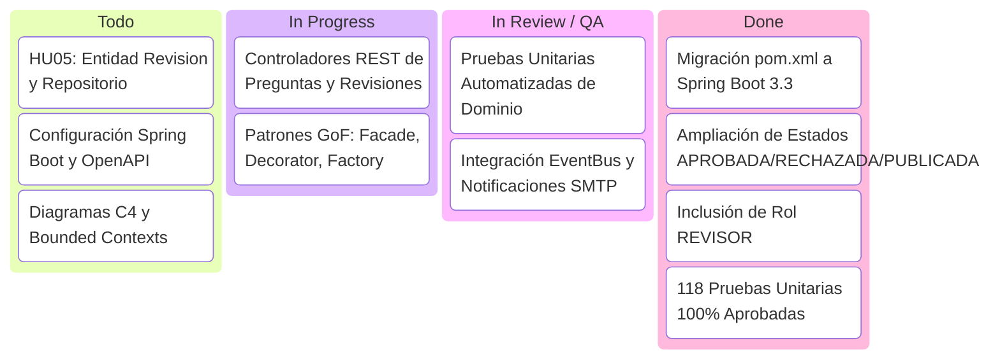
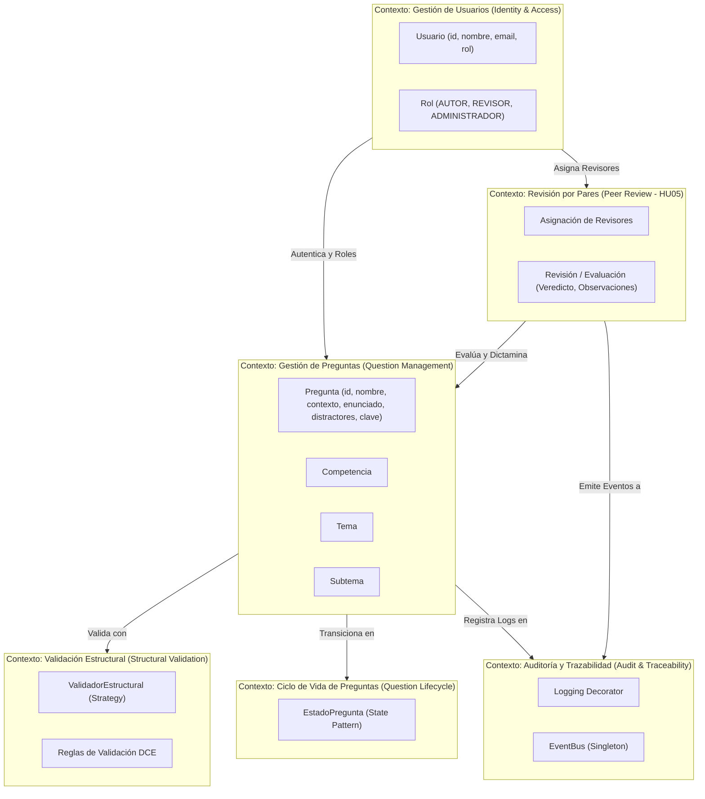
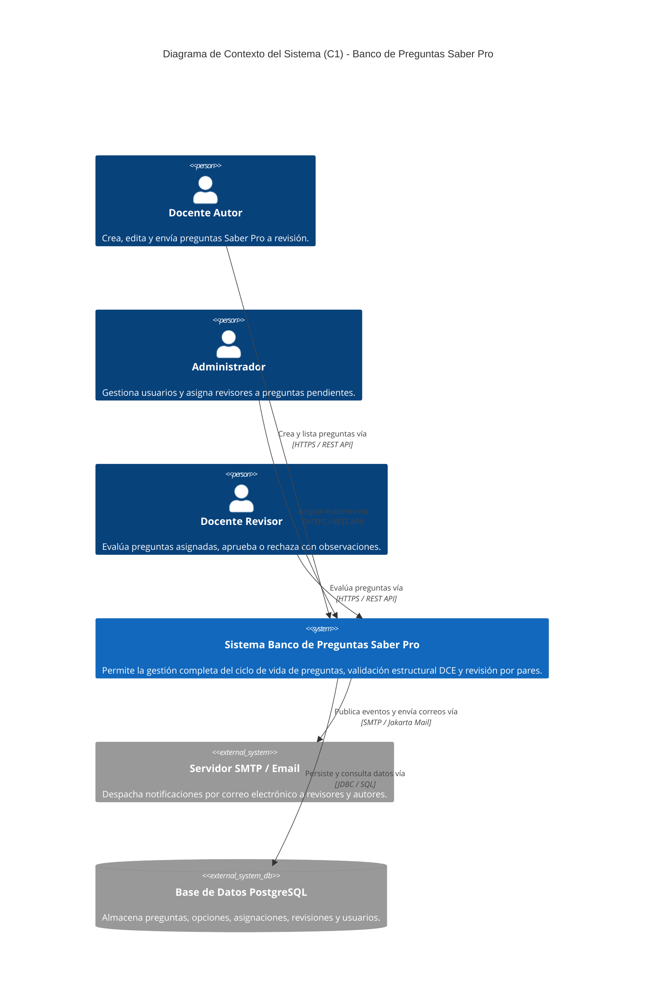
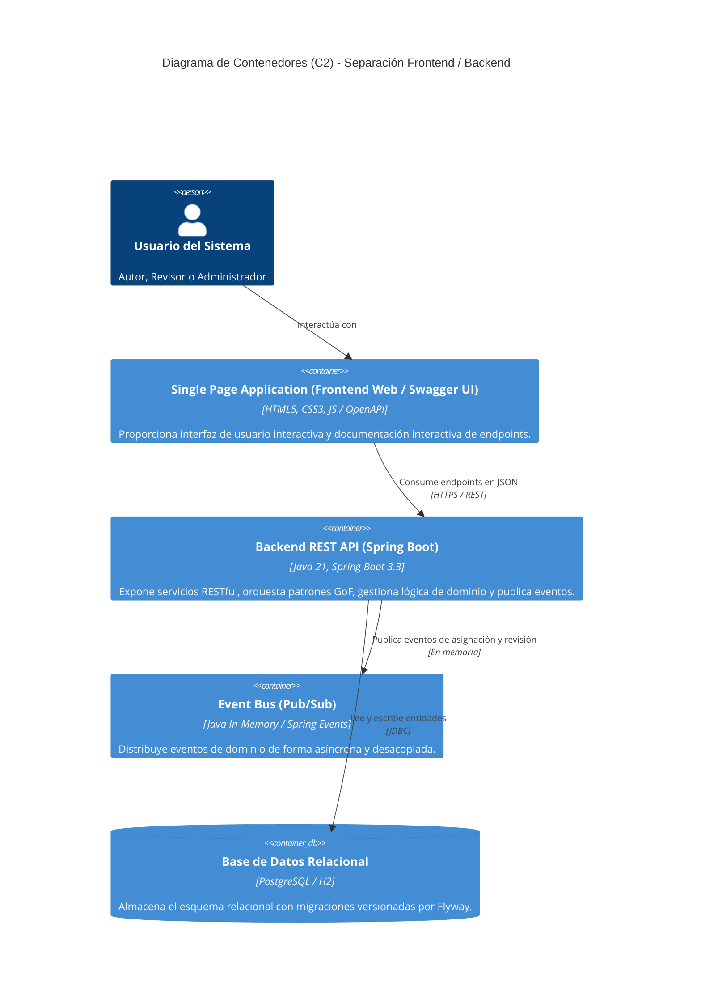
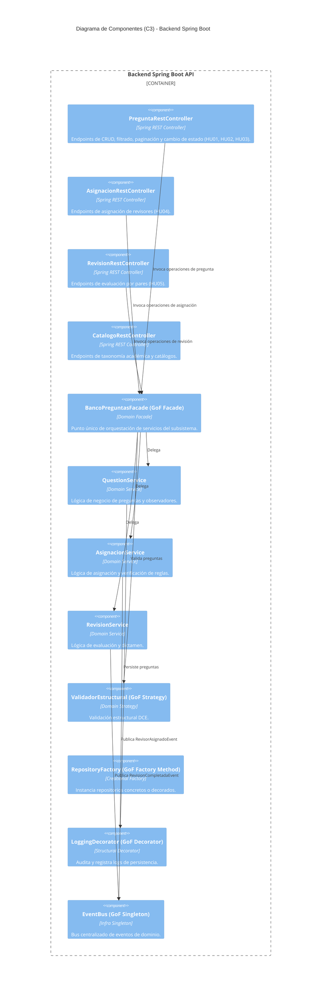

# Banco de Preguntas Saber Pro — Documento de Arquitectura de Software
## Segundo Entregable (Corte 2) — Solución Distribuida, Microservicios y API REST

---

### Portada

- **Institución:** Universidad del Cauca
- **Facultad:** Facultad de Ingeniería Electrónica y Telecomunicaciones (FIET)
- **Programa:** Ingeniería de Sistemas
- **Asignatura:** Ingeniería de Software II (Grupos A, B y Laboratorios A, B, C)
- **Docentes:** Paola Andrea Bedoya, Pablo Magé, W. Libardo Pantoja, Julio Hurtado
- **Periodo Académico:** 2026.2
- **Integrantes del Equipo:**
  - Santiago Caicedo
  - Ivan Alexander Lopez
  - Adrian Araujo Urbano
  - Carlos Bambague
- **Fecha de Entrega:** Octubre de 2026

---

## 1. Introducción

El presente documento describe la arquitectura de software de la segunda iteración (Corte 2) para el **Banco de Preguntas Saber Pro**. El objetivo fundamental de esta iteración es transformar la arquitectura monolítica inicial en una **arquitectura desacoplada, orientada a microservicios y guiada por eventos (Event-Driven Architecture)**, separando de manera estricta el Frontend y el Backend a través de una **API RESTful** documentada mediante Swagger / OpenAPI 3.

Esta refactorización responde al atributo de calidad de **escalabilidad** y **modificabilidad**, permitiendo que los diferentes contextos de negocio (gestión de preguntas, validación estructural, ciclo de vida, asignación y revisión por pares) puedan evolucionar y desplegarse de manera independiente y asíncrona.

---

## 2. Historias de Usuario (con Criterios de Aceptación)

### HU01: Creación de Preguntas con Validación Estructural (Autor)
**Como** autor de preguntas  
**Quiero** crear preguntas de selección múltiple con única respuesta acordes a los principios del Diseño Centrado en Evidencia (DCE)  
**Para** alimentar el banco de preguntas Saber Pro de forma estandarizada.

> **Criterios de Aceptación (Gherkin):**
> ```gherkin
> Escenario: Creación exitosa de pregunta en estado BORRADOR
>   Dado que el autor ingresa todos los campos obligatorios: contexto (>=20 caracteres), enunciado (con signo ?), 4 distractores (A, B, C, D), respuesta correcta, justificación (>=20 caracteres), bibliografía, competencia, tema, subtema y nivel de dificultad
>   Cuando solicita la creación de la pregunta a través del endpoint POST /api/v1/preguntas
>   Entonces el sistema valida estructuralmente la pregunta mediante la estrategia de validación
>   Y la persiste en estado BORRADOR con un identificador único asignado
>   Y retorna código HTTP 201 Created con el detalle de la pregunta.
>
> Escenario: Rechazo por incumplimiento de validación estructural
>   Dado que el autor omite un distractor o la justificación tiene menos de 20 caracteres
>   Cuando solicita la creación de la pregunta
>   Entonces el validador estructural rechaza la petición
>   Y el sistema retorna código HTTP 400 Bad Request con la lista detallada de campos inválidos.
> ```

---

### HU02: Transición de Estado de Borrador a Pendiente de Revisión (Autor)
**Como** autor de preguntas  
**Quiero** cambiar el estado de mis preguntas de "Borrador" a "Pendiente de revisión"  
**Para** que el administrador pueda asignarles docentes revisores.

> **Criterios de Aceptación (Gherkin):**
> ```gherkin
> Escenario: Envío exitoso a revisión
>   Dado que la pregunta se encuentra en estado BORRADOR o RECHAZADA y pertenece al autor autenticado
>   Cuando el autor invoca el cambio de estado mediante PATCH /api/v1/preguntas/{id}/estado con nuevoEstado = "PENDIENTE_REVISION"
>   Entonces el sistema valida que la pregunta esté estructuralmente completa
>   Y transiciona el estado a PENDIENTE_REVISION (Color Hex: #E6A014)
>   Y notifica a los observadores del cambio.
>
> Escenario: Rechazo de transición no permitida
>   Dado que una pregunta ya está en estado EN_REVISION o PUBLICADA
>   Cuando se intenta forzar el estado a PENDIENTE_REVISION
>   Entonces el enum de EstadoPregunta rechaza la transición inválida
>   Y el sistema retorna código HTTP 400 Bad Request.
> ```

---

### HU03: Búsqueda, Filtrado y Paginación de Preguntas (Autor)
**Como** autor de preguntas  
**Quiero** listar y filtrar las preguntas que he creado mediante filtros multicriterio y paginación  
**Para** gestionar y consultar eficientemente mi catálogo de preguntas.

> **Criterios de Aceptación (Gherkin):**
> ```gherkin
> Escenario: Búsqueda paginada con filtros combinados
>   Dado que existen múltiples preguntas en el sistema
>   Cuando el autor consulta GET /api/v1/preguntas con parámetros autorId, estado, tema, dificultad, palabra clave, pagina=1 y tamano=10
>   Entonces el sistema aplica el filtro en el repositorio
>   Y retorna una página de resultados con el total de elementos, total de páginas y la lista de preguntas con su código de color hexadecimal.
> ```

---

### HU04: Asignación de Revisores por Pares con Notificación (Administrador)
**Como** administrador del banco  
**Quiero** asignar entre 1 y 3 revisores pares a las preguntas en estado "Pendiente de revisión"  
**Para** someter las preguntas al proceso formal de evaluación docente.

> **Criterios de Aceptación (Gherkin):**
> ```gherkin
> Escenario: Asignación exitosa de revisores con notificación por correo
>   Dado que una pregunta está en estado PENDIENTE_REVISION
>   Cuando el administrador envía una solicitud POST /api/v1/asignaciones con el preguntaId y una lista de 1 a 3 revisores (excluyendo al autor)
>   Entonces la pregunta pasa al estado EN_REVISION (#1E78D2)
>   Y se persiste el registro de asignación
>   Y el bus de eventos publica RevisorAsignadoEvent
>   Y el servicio de correo envía las notificaciones asíncronas vía SMTP a cada revisor asignado.
>
> Escenario: Rechazo si el autor está incluido entre los revisores
>   Dado que el administrador intenta asignar al autor de la pregunta como su propio revisor
>   Cuando se procesa la asignación
>   Entonces el servicio de negocio rechaza la asignación
>   Y la pregunta permanece en PENDIENTE_REVISION sin enviar notificaciones.
> ```

---

### HU05: Evaluación y Revisión por Pares (Revisor) — *Nueva en Corte 2*
**Como** revisor de preguntas  
**Quiero** listar las preguntas que me han sido asignadas, evaluarlas y cambiar su estado a "Aprobada" o "Rechazada" con observaciones  
**Para** garantizar la calidad pedagógica y técnica antes de su publicación en los simulacros.

> **Criterios de Aceptación (Gherkin):**
> ```gherkin
> Escenario: Consulta de preguntas asignadas
>   Dado un docente con rol REVISOR
>   Cuando consulta GET /api/v1/revisiones/asignadas/{revisorId}
>   Entonces el sistema retorna únicamente las preguntas en estado EN_REVISION asignadas a dicho docente.
>
> Escenario: Aprobación de pregunta con observaciones
>   Dado que el revisor asignado evalúa la pregunta mediante POST /api/v1/revisiones/evaluar con veredicto "APROBADA" y observaciones
>   Cuando se procesa la solicitud
>   Entonces la pregunta pasa al estado APROBADA (#28A745)
>   Y se registra la entidad Revision en el repositorio
>   Y se publica RevisionCompletadaEvent notificando al autor por correo.
>
> Escenario: Rechazo de pregunta con observaciones para corrección
>   Dado que el revisor identifica falencias en la pregunta y envía veredicto "RECHAZADA" con observaciones detalladas
>   Cuando se procesa la solicitud
>   Entonces la pregunta pasa al estado RECHAZADA (#DC3545)
>   Y la pregunta vuelve a habilitar los permisos de edición para que el autor pueda corregirla y reenviarla.
> ```

---

## 3. Planificación de Tareas del Sprint 2 (Scrum / Jira / Trello)

El desarrollo del Sprint 2 se organizó siguiendo la metodología Scrum con un tablero ágil dividido en cuatro fases principales:



### Resumen de Estimación de Tareas (Story Points):
| Tarea / Historia | Responsable | Estimación (SP) | Estado |
|---|---|---|---|
| Migración de arquitectura base a Spring Boot 3.3 | Santiago Caicedo | 5 | ✅ Completado |
| Ciclo de vida de estados y rol REVISOR | Ivan Alexander Lopez | 3 | ✅ Completado |
| Implementación HU05 (RevisionService, Eventos) | Adrian Araujo Urbano | 8 | ✅ Completado |
| API REST (Endpoints Pregunta, Asignación, Revisión) | Carlos Bambague | 8 | ✅ Completado |
| Implementación de los 6 Patrones GoF | Santiago Caicedo | 8 | ✅ Completado |
| Documentación Swagger / OpenAPI 3 | Ivan Alexander Lopez | 3 | ✅ Completado |
| Pruebas Unitarias Automatizadas (JUnit 5 / Mock) | Equipo Completo | 5 | ✅ Completado |

---

## 4. Escenario de Calidad: Escalabilidad

| Elemento | Especificación del Escenario de Calidad |
|---|---|
| **Atributo de Calidad** | **Escalabilidad y Modificabilidad** (ISO/IEC 25010) |
| **Contexto** | Periodo de convocatoria masiva Saber Pro donde cientos de docentes redactan, envían y revisan preguntas simultáneamente en el sistema. |
| **Fuente del Estímulo** | Docentes autores, administradores y revisores concurrentes realizando operaciones de creación, consulta paginada, asignación y dictamen de revisión. |
| **Estímulo** | Incremento súbito de peticiones concurrentes (hasta 500 peticiones/segundo) para consultas de catálogo, filtros de preguntas y envío de evaluaciones. |
| **Artefacto Afectado** | API REST Gateway, Servicios de Dominio (`QuestionService`, `RevisionService`), Bus de Eventos (`EventBus`) y Capa de Persistencia. |
| **Entorno** | Sistema en operación normal y picos de carga con base de datos distribuida PostgreSQL. |
| **Respuesta del Sistema** | 1. Desacoplamiento de operaciones síncronas (lectura/escritura REST) de las operaciones asíncronas pesadas (envío de correos SMTP) mediante EventBus.<br>2. Procesamiento paginado eficiente con índices en base de datos (`idx_preguntas_autor`, `idx_preguntas_estado`, `idx_revisiones_pregunta`).<br>3. Fachada (`BancoPreguntasFacade`) y Decorador (`LoggingQuestionRepositoryDecorator`) que permiten monitoreo sin degradar latencia. |
| **Medición de Calidad** | - Tiempo de respuesta promedio en endpoints REST < 200 ms.<br>- Cero pérdida de eventos de dominio.<br>- Disponibilidad del 99.9% ante picos de concurrencia. |
| **Resultado Esperado** | El sistema procesa todas las solicitudes sin bloqueos de hilos y las notificaciones se despachan en segundo plano garantizando la escalabilidad horizontal del backend. |

---

## 5. Arquitectura y Diseño de Software (Modelo C4 + Bounded Contexts)

### 5.1 Diagrama de Contextos Delimitados (Bounded Contexts - DDD)



---

### 5.2 Modelo C4 — Nivel 1: Diagrama de Contexto del Sistema (System Context)



---

### 5.3 Modelo C4 — Nivel 2: Diagrama de Contenedores (Container Diagram)



---

### 5.4 Modelo C4 — Nivel 3: Diagrama de Componentes (Component Diagram)



---

## 6. Patrones de Diseño GoF Implementados

Para cumplir y superar el requerimiento de al menos 6 patrones GoF (2 creacionales, 2 estructurales y 2 de comportamiento), se implementaron y probaron exhaustivamente los siguientes:

| Patrón GoF | Categoría | Clase / Interfaz Principal | Contexto de Aplicación y Justificación |
|---|---|---|---|
| **1. Builder** | Creacional | `QuestionBuilder` | Permite la construcción fluida, paso a paso y validada de preguntas complejas con múltiples componentes (contexto, opciones A-D, clave, justificación, taxonomía). |
| **2. Factory Method** | Creacional | `RepositoryFactory`, `InMemoryRepositoryFactory`, `DecoratedRepositoryFactory` | Desacopla la creación de repositorios concretos según el entorno de ejecución (Memoria, JDBC PostgreSQL, Repositorio Decorado con Auditoría). |
| **3. Singleton** | Creacional | `EventBus` | Garantiza una instancia única y global (`getInstance()`) con double-checked locking para el registro de suscriptores y distribución de eventos de dominio. |
| **4. Facade** | Estructural | `BancoPreguntasFacade` | Provee una interfaz unificada de alto nivel para los controladores REST y clientes externos, ocultando la complejidad de interacción entre múltiples servicios de dominio. |
| **5. Decorator** | Estructural | `LoggingQuestionRepositoryDecorator` | Envuelve `QuestionRepository` para interceptar operaciones, añadir auditoría y métricas de ejecución sin modificar el código fuente de los repositorios subyacentes. |
| **6. Strategy** | Comportamiento | `ReglaValidacion`, `ValidadorEstructuralPregunta` | Encapsula algoritmos de validación estructural intercambiables (DCE, reglas de longitud, presencia de distractores) que pueden extenderse dinámicamente. |
| **7. Observer / Pub-Sub** | Comportamiento | `PreguntaEventPublisher`, `Subject`, `EventListener` | Desacopla la lógica de negocio de la notificación por email mediante publicación y suscripción a eventos (`RevisorAsignadoEvent`, `RevisionCompletadaEvent`). |
| **8. State** | Comportamiento | `EstadoPregunta` | Encapsula el ciclo de vida de la pregunta (`BORRADOR`, `PENDIENTE_REVISION`, `EN_REVISION`, `APROBADA`, `RECHAZADA`, `PUBLICADA`, `ARCHIVADA`), sus reglas de transición, permisos de edición y colores de visualización. |

---

## 7. Documentación de la API REST (Swagger / OpenAPI 3)

La API REST se encuentra documentada interactivamente bajo la especificación OpenAPI 3. Al iniciar el backend, la documentación se encuentra disponible en:
- **Swagger UI:** `http://localhost:8080/swagger-ui.html`
- **OpenAPI JSON:** `http://localhost:8080/api-docs`

### Tabla de Endpoints Principales:
| Módulo | Método | Endpoint | Descripción | HU Asociada |
|---|---|---|---|---|
| **Preguntas** | `POST` | `/api/v1/preguntas` | Crear pregunta en estado BORRADOR con validación DCE | HU01 |
| **Preguntas** | `POST` | `/api/v1/preguntas/validar` | Validar estructuralmente sin guardar | HU01 |
| **Preguntas** | `GET` | `/api/v1/preguntas/{id}` | Obtener detalle completo de pregunta | HU03 |
| **Preguntas** | `GET` | `/api/v1/preguntas` | Listado paginado con filtros multicriterio | HU03 |
| **Preguntas** | `GET` | `/api/v1/preguntas/autor/{autorId}` | Listar preguntas de un autor | HU03 |
| **Preguntas** | `PATCH`| `/api/v1/preguntas/{id}/estado` | Cambiar estado de la pregunta (ej. a PENDIENTE_REVISION) | HU02 |
| **Asignaciones** | `GET` | `/api/v1/asignaciones/pendientes` | Listar preguntas en espera de asignación | HU04 |
| **Asignaciones** | `POST`| `/api/v1/asignaciones` | Asignar 1-3 revisores y enviar correo | HU04 |
| **Revisiones** | `GET` | `/api/v1/revisiones/asignadas/{revisorId}`| Listar preguntas asignadas al revisor | HU05 |
| **Revisiones** | `POST`| `/api/v1/revisiones/evaluar` | Evaluar pregunta (APROBADA/RECHAZADA) + observaciones | HU05 |
| **Revisiones** | `GET` | `/api/v1/revisiones/historial/{preguntaId}`| Consultar histórico de evaluaciones | HU05 |
| **Usuarios** | `GET` | `/api/v1/usuarios` | Listar todos los usuarios del sistema | Soporte |
| **Usuarios** | `GET` | `/api/v1/usuarios/revisores` | Listar docentes revisores | HU04 |
| **Catálogos** | `GET` | `/api/v1/catalogos/estados` | Listar estados con colores HEX y reglas de edición | HU02 |
| **Catálogos** | `GET` | `/api/v1/catalogos/competencias` | Listar competencias Saber Pro | HU01 |

---

## 8. Pruebas Unitarias Automatizadas

Se cuenta con una suite integral de **118 pruebas unitarias automatizadas** con **100% de éxito**, cubriendo todas las clases de entidades, servicios, patrones GoF y controladores REST:

```
-------------------------------------------------------
 T E S T S   S U M M A R Y
-------------------------------------------------------
Tests run: 118, Failures: 0, Errors: 0, Skipped: 0
Status: BUILD SUCCESS
-------------------------------------------------------
```

### Cobertura de Pruebas por Módulo:
- `co.unicauca.iso2.bancopreguntas.domain`:
  - `QuestionTest`, `QuestionBuilderTest`, `EstadoPreguntaTest`, `EntidadesDominioTest`, `QuestionServiceTest`
  - `RevisionTest` (Pruebas unitarias de la entidad de evaluación)
  - `RevisionServiceTest` (Pruebas de la lógica HU05: asignadas, evaluación, rechazo, aprobación, publicación de eventos, control de acceso de revisor)
  - `BancoPreguntasFacadeTest` (Pruebas del patrón Facade y flujo de integración)
- `co.unicauca.iso2.bancopreguntas.access`:
  - `QuestionJdbcRepositoryH2Test` (Pruebas de base de datos con H2/Flyway)
  - `RevisionImplRepositoryTest` (Pruebas de persistencia de revisiones)
  - `RepositoryFactoryTest` (Pruebas del patrón Factory Method)
  - `LoggingQuestionRepositoryDecoratorTest` (Pruebas del patrón Decorator)
- `co.unicauca.iso2.bancopreguntas.infra`:
  - `SubjectTest`, `AsignacionServiceTest` (Pruebas del patrón Observer / Pub-Sub)
  - `EventBusTest` (Pruebas del patrón Singleton)
- `co.unicauca.iso2.bancopreguntas.presentation.rest`:
  - `PreguntaRestControllerTest` (Pruebas de endpoints REST con Spring Boot Test)
  - `RevisionRestControllerTest` (Pruebas de flujo completo de revisión REST HU05)

---

## 9. Protocolo de Sustentación en Video (YouTube)

Estructura de tiempos para la grabación del video de sustentación de acuerdo con las especificaciones de la rúbrica:

| Minuto | Tema a Sustentar | Contenido Clave a Mostrar | Participante |
|---|---|---|---|
| **Min 0 - 1** (1 min) | Historias de Usuario (Iteración 2) | Presentación de las 5 HU implementadas con énfasis en la nueva HU05 (Revisión por Pares). | Integrante 1 |
| **Min 1 - 2** (1 min) | Escenario de Calidad de Escalabilidad | Explicación del escenario SEI de escalabilidad, concurrencia de docentes y respuesta desacoplada. | Integrante 2 |
| **Min 2 - 4** (2 min) | Arquitectura y Diseño (C4 + API REST) | Explicación de los diagramas C4 (Contexto C1, Contenedores C2, Componentes C3) y separación Frontend/Backend. | Integrante 3 |
| **Min 4 - 6** (2 min) | 6 Patrones GoF Implementados | Explicación en código de Builder, Factory Method, Singleton, Facade, Decorator, Strategy y State. | Integrante 4 |
| **Min 6 - 7** (1 min) | Diagrama de Contextos Delimitados | Explicación del Bounded Context DDD y sus límites funcionales. | Integrante 1 |
| **Min 7 - 8** (1 min) | Pruebas Unitarias Automatizadas | Ejecución de `mvn test` en vivo mostrando las 118 pruebas pasando exitosamente. | Integrante 2 |
| **Min 8 - 9** (1 min) | Repositorio Git y Tablero Scrum | Muestra del historial de commits en GitHub de todos los integrantes y el tablero Scrum del Sprint 2. | Integrante 3 |
| **Min 9 - 10** (1 min) | API REST en Swagger UI | Demostración de `/swagger-ui.html` ejecutando peticiones interactivas. | Integrante 4 |
| **Min 10 - 15** (5 min) | Software Funcional y Aspectos Clave | Demostración en vivo del flujo completo (Crear pregunta -> Enviar a revisión -> Asignar revisores -> Evaluar en HU05 -> Notificación por correo). | Todos los Integrantes |

---

## 10. Enlaces de Entrega

- **Repositorio GitHub:** [https://github.com/santyxswc/Banco_preguntas-ISoftII](https://github.com/santyxswc/Banco_preguntas-ISoftII)
- **Documentación Swagger Local:** `http://localhost:8080/swagger-ui.html`
- **URL Video de YouTube:** *(Agregar enlace de grabación del equipo)*
